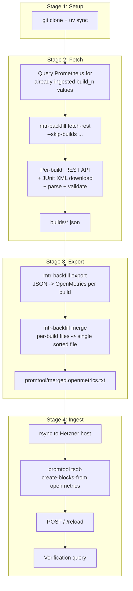
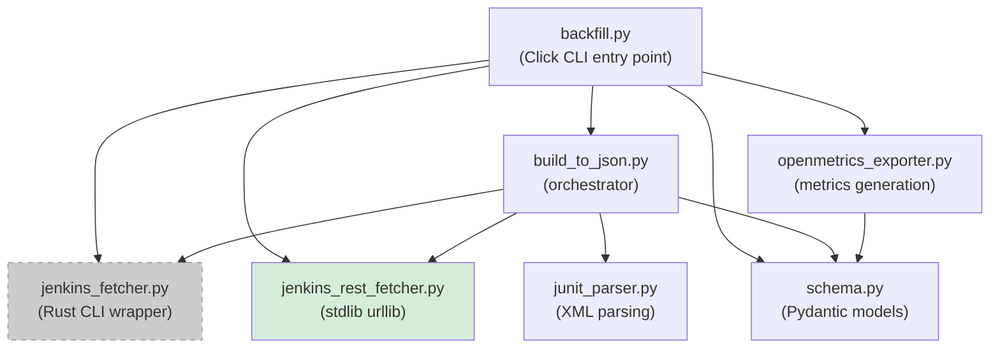
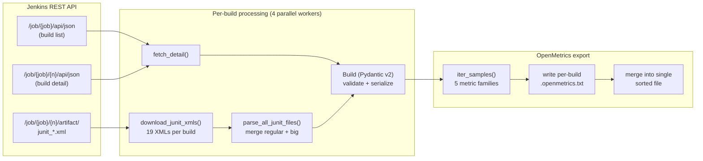
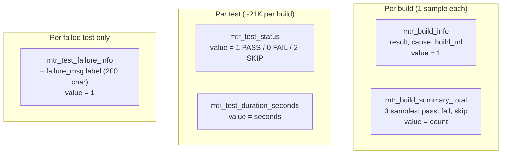
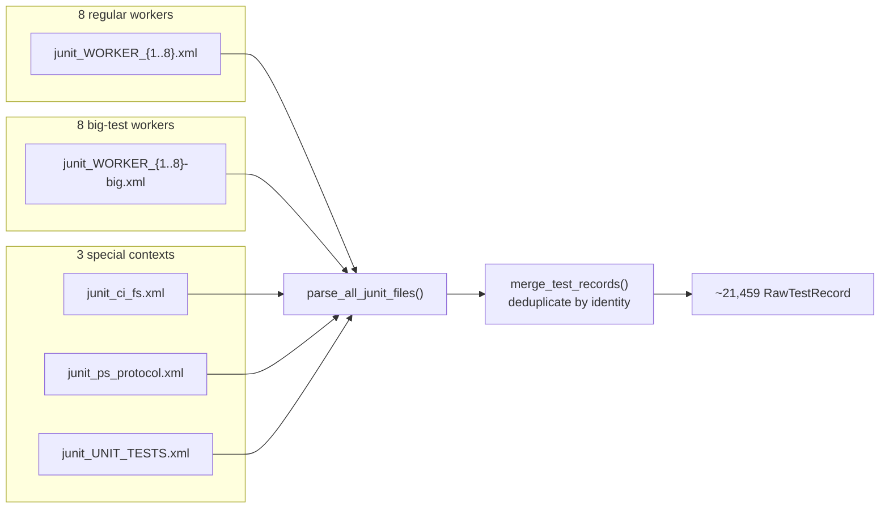
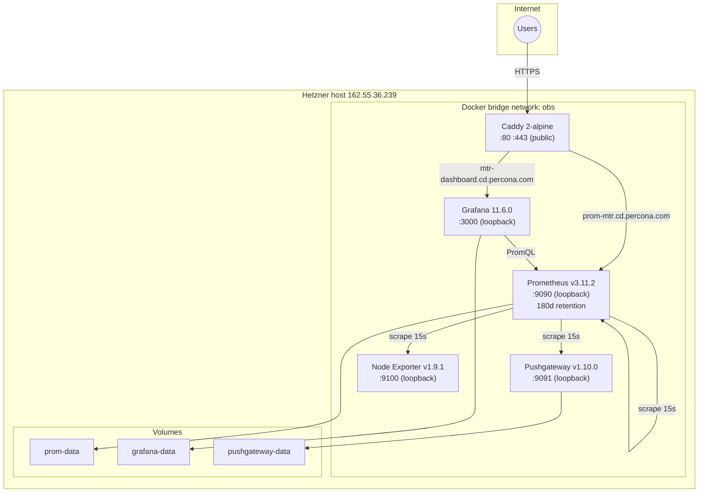
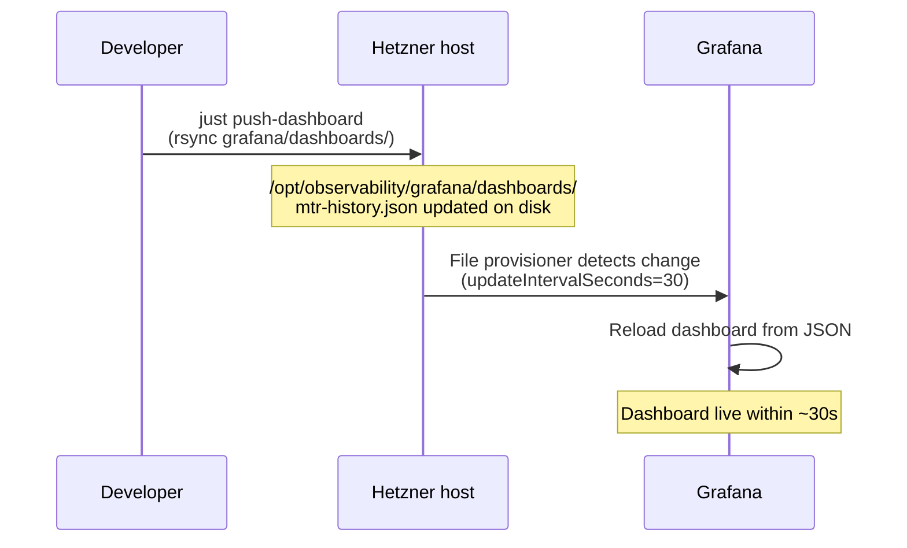
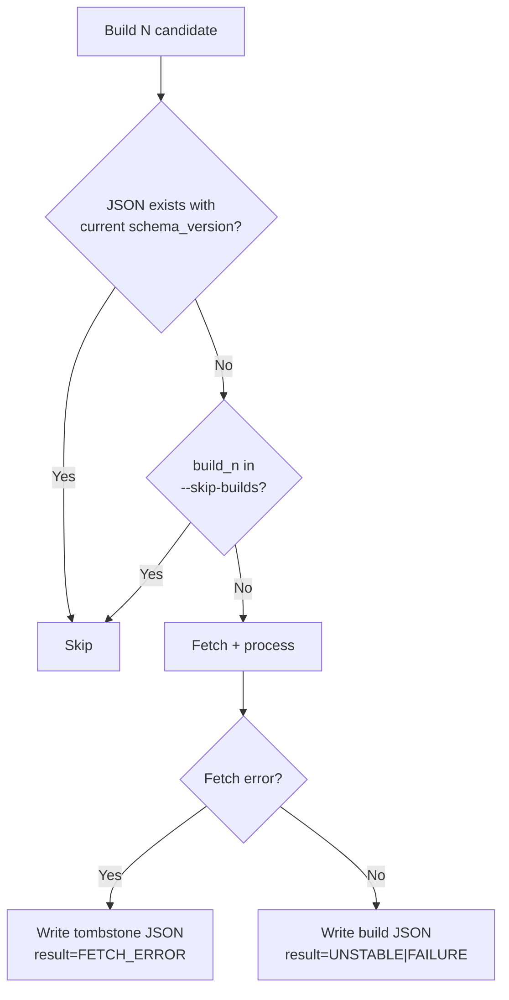
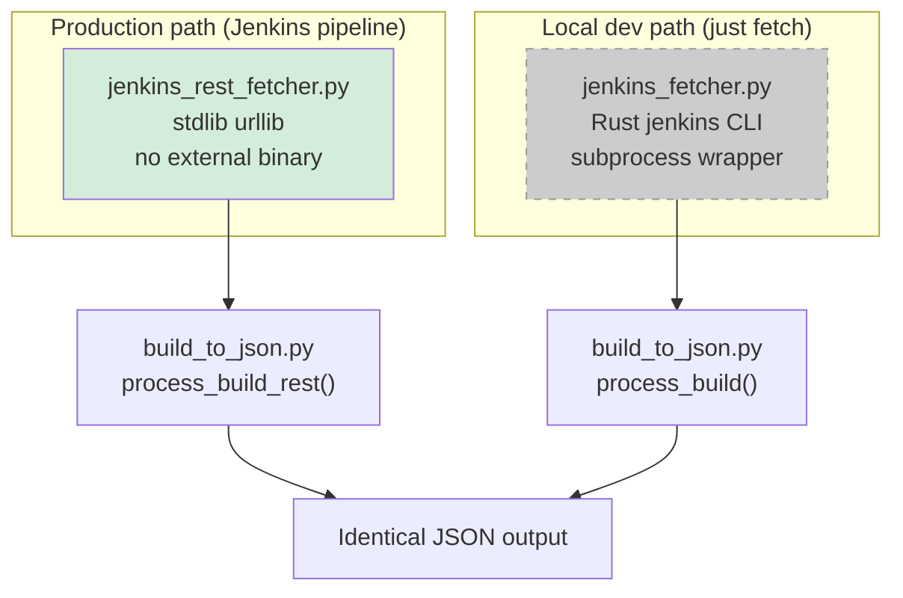

# Architecture

## System overview


## Pipeline stages

The pipeline runs as a Jenkins job (`mysql-mtr-history-dashboard` on ps80)
or locally via `just` recipes. Four stages, each idempotent:



## Python module dependency graph



**Solid boxes** = production path (Jenkins pipeline).
**Dashed box** (`jenkins_fetcher.py`) = local dev only (requires Rust `jenkins` binary).

## Data transformation pipeline



## Prometheus metrics

Five metric families emitted per build:



Common labels across all metrics:
`instance`, `job_name`, `build` (zero-padded), `build_n` (unpadded),
`platform_os`, `platform_build`, `arch`, `branch`, `fork`.

Test-level metrics add: `suite`, `testname`, `run_context`, `worker_slug`, `worker_num`.

All samples are timestamped at **build start time** (historical, not wall clock).

## JUnit XML parsing

19 XML files per full MTR build:



**Test identity:** `(suite, name, run_context)` -- worker and big are
attributes, not identity. Regular and big are NOT merged across each other.

**Merge rule:** On exact-identity duplicates (same suite/name/context/worker/big),
the non-skip record wins.

## Infrastructure topology



All services use `restart: unless-stopped`. Only Caddy binds to `0.0.0.0`;
all other services bind to `127.0.0.1`.

## Dashboard provisioning



For full deploys (provisioning YAML + compose override + dashboards):
```bash
just deploy-dashboard
```

## Idempotency mechanisms



Three layers of idempotency:
1. **Schema version check** -- `build_to_json` skips if JSON exists with `schema_version == SCHEMA_VERSION`
2. **Prometheus pre-query** -- Jenkins pipeline queries for already-ingested `build_n` values, passes as `--skip-builds`
3. **`--force` flag** -- overrides all checks for re-processing

Tombstone JSONs (`result=FETCH_ERROR`) prevent retrying permanently broken builds
on every run while preserving the error context in `backfill_meta.error`.

## Error handling

| Layer | Strategy |
|-------|----------|
| Per-build fetch | Catch all exceptions, write tombstone JSON, continue with next build |
| JUnit XML parsing | Catch `ParseError`/`OSError` per file, add to warnings, continue |
| ThreadPoolExecutor | 4 parallel workers, individual failures don't kill the batch |
| Pipeline summary | Classify results as processed/skipped/tombstone/errored, print counts |

## Two fetcher backends



Both backends produce **byte-identical** output (cross-verified on build 1558:
21,459 tests, exact match). The REST path is used in production because the
Jenkins pipeline agent doesn't have the Rust `jenkins` binary installed.
